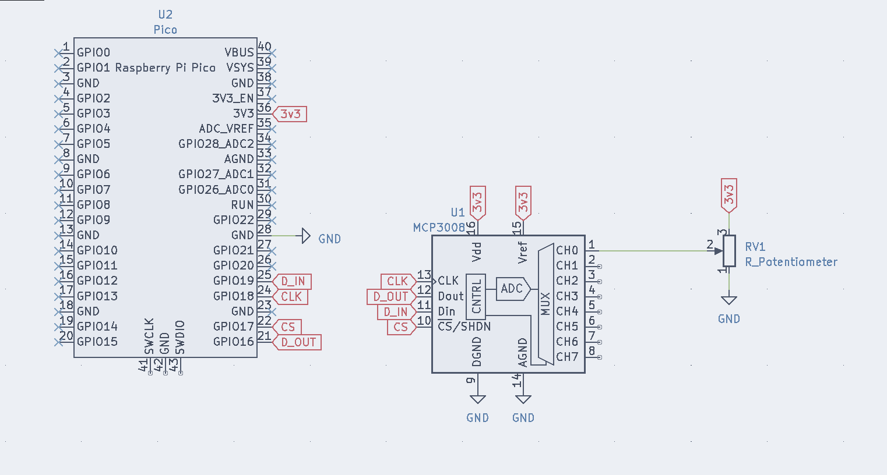

# MCP3008

Kaluma library for MCP3008 8-Channel 10-Bit ADC with SPI Interface.

## Usage

```
// pass in an Kaluma SPI instance and also the pin number of your chip select pin
const mcp3008 = new MCP3008(spi, CHIP_SELECT_PIN);

// now you can do this to read from a single channel of the mcp3008
const value = mcp3008.read(channelNumber)
```

See `example.js` for more detailed example.

## Installation

add it to your package.json directly with this repository link.

or with `npm`

```bash
npm install https://github.com/alexander-daniel/mcp3008
```

```
  "dependencies": {
    "mcp3008": "https://github.com/alexander-daniel/mcp3008.git"
  }
```

## Wiring


